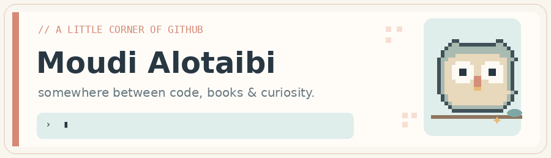
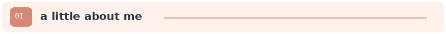
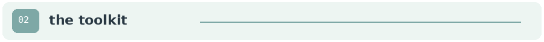
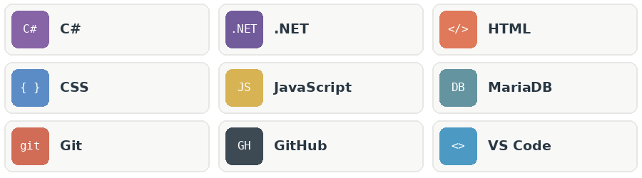
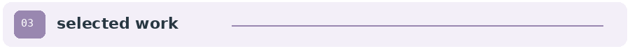
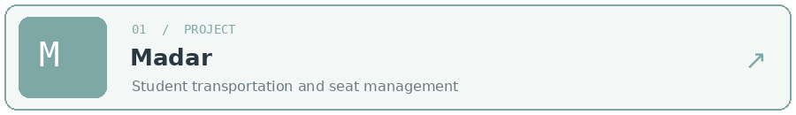
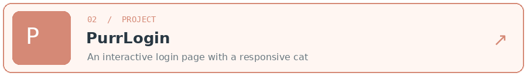
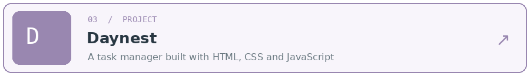

  

<a href="https://github.com/ili1iml?tab=repositories">Projects</a> &nbsp;·&nbsp; <a href="https://x.com/ili1iml">X</a>

 

IT graduate and junior .NET developer. I build web applications with **ASP.NET Core and C#**, and enjoy shaping the details people see and use on the front end.

 

 

 

still learning · still building &nbsp;✦

